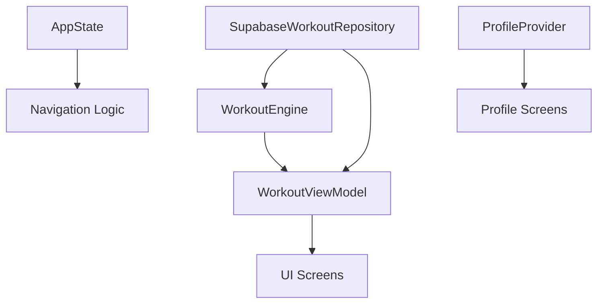
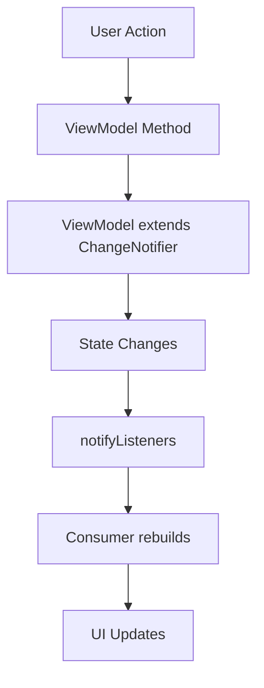
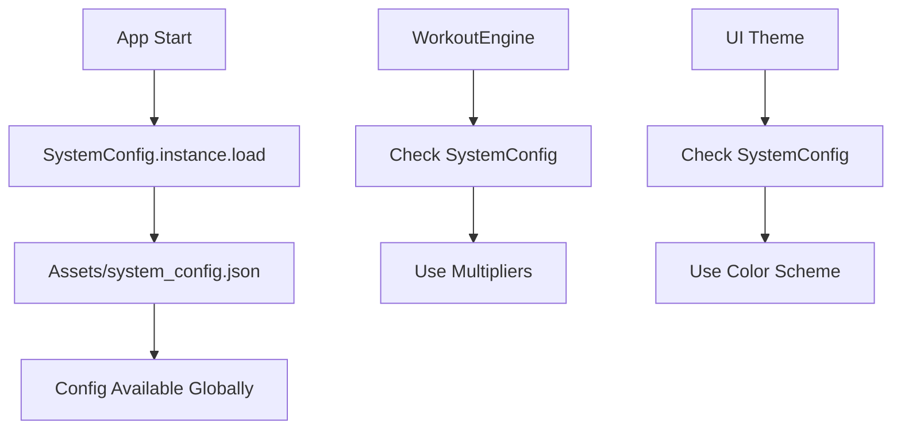

# HEAVYWEIGHT Component Interaction Guide

## Overview
This document explains how every component in the HEAVYWEIGHT app interacts with other components, showing dependencies, communication patterns, and integration points.

---

## 🏗️ **Architecture Layer Interactions**

### **Layer Dependencies**
```
📱 UI Layer (Screens/Widgets)
    ↓ depends on
🧠 Presentation Layer (ViewModels)  
    ↓ depends on
🏗️ Business Layer (WorkoutEngine)
    ↓ depends on
🗄️ Data Layer (Repository)
    ↓ depends on
🔌 Infrastructure (Supabase/SharedPreferences)
```

**Rule**: Higher layers can depend on lower layers, but not vice versa.

---

## 🎯 **Core Component Interactions**

### **1. WorkoutEngine ↔ Repository**
*The engine uses repository for data, repository has no knowledge of engine logic*

```dart
// workout_engine.dart
class WorkoutEngine {
  final WorkoutRepositoryInterface? repository;
  
  Future<DailyWorkout> generateDailyWorkout(List<SetData> history) async {
    // Engine calls repository for data
    final exercises = await repository?.fetchCompleteWorkoutDay(dayId);
    
    // Engine processes data using business logic
    final plannedExercises = <PlannedExercise>[];
    for (final exercise in exercises) {
      final weight = calculatePrescribedWeight(exercise.id, history);
      // ... business logic
    }
  }
}
```

**Interaction Pattern**:
- **Engine → Repository**: Requests data via interface methods
- **Repository → Engine**: Returns data models (SetData, Exercise, etc.)
- **No reverse dependency**: Repository never calls engine methods

---

### **2. ViewModel ↔ Engine + Repository**
*ViewModels orchestrate between UI and business logic*

```dart
// workout_viewmodel.dart
class WorkoutViewModel extends ChangeNotifier {
  final WorkoutRepositoryInterface repository;
  final WorkoutEngine engine;
  
  Future<void> initialize() async {
    // ViewModel coordinates between repository and engine
    final history = await repository.getHistory();        // Repository call
    final workout = await engine.generateDailyWorkout(history); // Engine call
    
    _todaysWorkout = workout;
    notifyListeners(); // Notifies UI
  }
  
  Future<void> processWorkoutResults(List<SetData> results) async {
    // ViewModel orchestrates business operations
    for (final set in results) {
      await repository.saveSet(set);     // Data persistence
    }
    await TrainingState.completeDay();  // Cross-device sync
    await refresh();                    // UI refresh
  }
}
```

**Interaction Pattern**:
- **ViewModel → Engine**: Calls business logic methods
- **ViewModel → Repository**: Performs data operations
- **ViewModel → UI**: Notifies state changes via notifyListeners()

---

### **3. Screen ↔ ViewModel**
*Screens consume ViewModel state and trigger ViewModel actions*

```dart
// assignment_screen.dart
class AssignmentScreen extends StatefulWidget {
  @override
  Widget build(BuildContext context) {
    return Consumer<WorkoutViewModel>(
      builder: (context, viewModel, child) {
        // Screen reacts to ViewModel state
        if (viewModel.isLoading) {
          return CircularProgressIndicator();
        }
        
        if (viewModel.error != null) {
          return ErrorWidget(viewModel.error!);
        }
        
        return WorkoutDisplay(
          workout: viewModel.todaysWorkout,
          onStartWorkout: () {
            // Screen triggers ViewModel action
            viewModel.beginProtocol();
          },
        );
      },
    );
  }
}
```

**Interaction Pattern**:
- **Screen → ViewModel**: Calls action methods (beginProtocol, refresh, etc.)
- **ViewModel → Screen**: State changes trigger UI rebuilds
- **Provider Pattern**: Consumer widget automatically rebuilds on state changes

---

## 🔌 **Provider System Interactions**

### **Provider Hierarchy**
```dart
// main.dart
MultiProvider(
  providers: [
    // Core Services (bottom layer)
    Provider<SupabaseWorkoutRepository>(
      create: (_) => SupabaseWorkoutRepository(),
    ),
    
    // Business Logic (middle layer)
    ChangeNotifierProvider<WorkoutEngine>(
      create: (context) => WorkoutEngine(
        repository: context.read<SupabaseWorkoutRepository>(),
      ),
    ),
    
    // Presentation Logic (top layer)
    ChangeNotifierProvider<WorkoutViewModel>(
      create: (context) => WorkoutViewModel(
        repository: context.read<SupabaseWorkoutRepository>(),
        engine: context.read<WorkoutEngine>(),
      ),
    ),
  ],
  child: App(),
)
```

### **Provider Dependencies**


**Dependency Rules**:
- **Repository**: No dependencies (can be created independently)
- **WorkoutEngine**: Depends on Repository
- **WorkoutViewModel**: Depends on both Repository and Engine
- **Screens**: Depend on ViewModels

---

## 🎨 **UI Component Interactions**

### **Reusable Component Usage**
```dart
// Components are used across multiple screens
HeavyweightScaffold  // Used by ALL screens
├── AssignmentScreen
├── ProtocolScreen  
├── SessionCompleteScreen
└── TrainingLogScreen

CommandButton  // Used throughout app
├── Primary actions (START WORKOUT)
├── Secondary actions (VIEW LOG)
└── Navigation buttons

HWTextField  // Used in forms
├── Profile setup
├── Configuration screens
└── Debug tools
```

### **Component Communication Patterns**

#### **Parent → Child (Props)**
```dart
// Parent passes data down
CommandButton(
  text: 'START_WORKOUT',
  variant: ButtonVariant.primary,
  onPressed: () => startWorkout(),  // Callback function
)

// Child receives and uses data
class CommandButton extends StatelessWidget {
  final String text;
  final ButtonVariant variant;
  final VoidCallback? onPressed;
  
  @override
  Widget build(BuildContext context) {
    return ElevatedButton(
      onPressed: onPressed,  // Uses parent's callback
      child: Text(text),     // Uses parent's data
    );
  }
}
```

#### **Child → Parent (Callbacks)**
```dart
// Parent defines callback
class ProtocolScreen extends StatefulWidget {
  void _handleSetComplete(int reps) {
    // Parent handles child's action
    final setData = SetData(/* ... */);
    _completedSets.add(setData);
    _startRestTimer();
  }
  
  @override
  Widget build(BuildContext context) {
    return SetInputWidget(
      onSetComplete: _handleSetComplete,  // Pass callback to child
    );
  }
}

// Child triggers callback
class SetInputWidget extends StatelessWidget {
  final Function(int) onSetComplete;
  
  void _submitReps() {
    final reps = int.parse(_repsController.text);
    onSetComplete(reps);  // Notify parent
  }
}
```

---

## 🗄️ **Data Layer Interactions**

### **Repository ↔ Supabase**
```dart
// supabase_workout_repository.dart
class SupabaseWorkoutRepository implements WorkoutRepositoryInterface {
  final SupabaseClient _supabase = supabase;  // Global client
  
  @override
  Future<void> saveSet(SetData set) async {
    // Repository translates domain objects to database schema
    await _supabase.from('sets').insert({
      'workout_id': await _getOrCreateWorkoutId(),
      'exercise_id': await _getExerciseDbId(set.exerciseId),
      'weight': set.weight,
      'actual_reps': set.actualReps,
      'set_number': set.setNumber,
      'rest_taken': set.restTaken,
    });
  }
}
```

### **Repository ↔ Local Storage**
```dart
// training_state.dart - Used by Repository
class TrainingState {
  static Future<void> assignDay(String dayName) async {
    // Local storage interaction
    final prefs = await SharedPreferences.getInstance();
    await prefs.setString(_keyLastAssignedDay, dayName);
    
    // Also sync to Supabase
    await _syncToServer(dayName);
  }
}

// Repository uses both Supabase and TrainingState
class SupabaseWorkoutRepository {
  Future<DailyWorkout> generateWorkout() async {
    // Coordinate local and remote state
    final lastDay = await TrainingState.getLastAssignedDay();
    final history = await getHistory();  // From Supabase
    // ... combine data sources
  }
}
```

---

## 🔄 **State Management Interactions**

### **ChangeNotifier Pattern**


**Example Implementation**:
```dart
// ViewModel manages state
class WorkoutViewModel extends ChangeNotifier {
  DailyWorkout? _todaysWorkout;
  bool _isLoading = true;
  String? _error;
  
  // Getters expose state
  DailyWorkout? get todaysWorkout => _todaysWorkout;
  bool get isLoading => _isLoading;
  String? get error => _error;
  
  // Methods update state and notify
  Future<void> refresh() async {
    _isLoading = true;
    _error = null;
    notifyListeners();  // UI shows loading
    
    try {
      _todaysWorkout = await _generateWorkout();
      _isLoading = false;
      notifyListeners();  // UI shows workout
    } catch (e) {
      _error = e.toString();
      _isLoading = false;
      notifyListeners();  // UI shows error
    }
  }
}

// UI automatically rebuilds
Consumer<WorkoutViewModel>(
  builder: (context, viewModel, child) {
    // This builder runs every time notifyListeners() is called
    if (viewModel.isLoading) return LoadingWidget();
    if (viewModel.error != null) return ErrorWidget(viewModel.error!);
    return WorkoutWidget(viewModel.todaysWorkout!);
  },
)
```

---

## 🔧 **Configuration System Interactions**

### **SystemConfig ↔ Components**


**Usage Pattern**:
```dart
// Any component can access config
class WorkoutEngine {
  double calculateNextWeight(double currentWeight, int actualReps) {
    // Config is globally accessible
    final cfg = SystemConfig.instance;
    
    if (actualReps == 0) {
      return currentWeight * cfg.multiplierFailure;
    }
    // ... use other config values
  }
}

// UI components can also use config
class ThemeProvider {
  ThemeData get theme {
    final cfg = SystemConfig.instance;
    return ThemeData(
      primaryColor: Color(cfg.primaryColorHex),
      // ... other theme properties from config
    );
  }
}
```

---

## 🔍 **Debugging Component Interactions**

### **Common Interaction Issues**

#### **1. Provider Not Found**
```dart
// ERROR: Could not find the correct Provider<WorkoutViewModel>

// CAUSE: Widget tries to read provider that doesn't exist in ancestor tree
final viewModel = context.read<WorkoutViewModel>();  // Fails

// SOLUTION: Ensure provider is in ancestor widget tree
MaterialApp(
  builder: (context, child) {
    return MultiProvider(
      providers: [
        ChangeNotifierProvider<WorkoutViewModel>(/*...*/),
      ],
      child: child!,
    );
  },
)
```

#### **2. Circular Dependencies**
```dart
// ERROR: Circular dependency between providers

// CAUSE: Two providers depend on each other
Provider<A>(create: (context) => A(context.read<B>())),
Provider<B>(create: (context) => B(context.read<A>())),  // Circular!

// SOLUTION: Restructure dependencies or use factories
Provider<A>(create: (_) => A()),
ProxyProvider<A, B>(
  update: (context, a, previous) => B(a),
),
```

#### **3. ViewModel Not Updating UI**
```dart
// PROBLEM: ViewModel state changes but UI doesn't rebuild

// CAUSE: Forgot to call notifyListeners()
void updateWorkout(DailyWorkout workout) {
  _todaysWorkout = workout;
  // Missing: notifyListeners();
}

// SOLUTION: Always call notifyListeners() after state changes
void updateWorkout(DailyWorkout workout) {
  _todaysWorkout = workout;
  notifyListeners();  // This triggers UI rebuild
}
```

### **Debugging Tools**

#### **Provider Inspector**
```dart
// Add this to debug provider states
class DebugProviderWidget extends StatelessWidget {
  @override
  Widget build(BuildContext context) {
    return Column(
      children: [
        Text('WorkoutViewModel: ${context.watch<WorkoutViewModel>().todaysWorkout?.dayName}'),
        Text('AppState: ${context.watch<AppState>().isOnboardingComplete}'),
        // ... other provider states
      ],
    );
  }
}
```

#### **State Change Logging**
```dart
// Add logging to ViewModels for debugging
class WorkoutViewModel extends ChangeNotifier {
  set todaysWorkout(DailyWorkout? workout) {
    HWLog.event('workout_viewmodel_state_change', data: {
      'previous_workout': _todaysWorkout?.dayName,
      'new_workout': workout?.dayName,
    });
    _todaysWorkout = workout;
    notifyListeners();
  }
}
```

---

## 🎯 **Component Modification Guidelines**

### **Adding New Components**

#### **1. New Screen**
```dart
// 1. Create screen widget
class NewFeatureScreen extends StatefulWidget {
  // 2. Add to routing
  // core/routes.dart: GoRoute(path: '/new-feature', ...)
  
  // 3. Add provider if needed
  // providers/new_feature_provider.dart
  
  // 4. Connect to existing ViewModels
  @override
  Widget build(BuildContext context) {
    return Consumer<WorkoutViewModel>(
      builder: (context, viewModel, child) {
        // Use existing ViewModel or create new one
      },
    );
  }
}
```

#### **2. New ViewModel**
```dart
// 1. Extend ChangeNotifier
class NewFeatureViewModel extends ChangeNotifier {
  final Repository repository;
  final Engine engine;
  
  // 2. Define dependencies in constructor
  NewFeatureViewModel({required this.repository, required this.engine});
  
  // 3. Add to provider setup
  ChangeNotifierProvider<NewFeatureViewModel>(
    create: (context) => NewFeatureViewModel(
      repository: context.read<Repository>(),
      engine: context.read<Engine>(),
    ),
  );
}
```

#### **3. New Repository Method**
```dart
// 1. Add to interface first
abstract class WorkoutRepositoryInterface {
  Future<NewData> getNewData();  // Add method signature
}

// 2. Implement in concrete class
class SupabaseWorkoutRepository implements WorkoutRepositoryInterface {
  @override
  Future<NewData> getNewData() async {
    // Implementation
  }
}

// 3. Use in ViewModels/Engine
class SomeViewModel {
  Future<void> loadNewData() async {
    final data = await repository.getNewData();  // Available immediately
  }
}
```

---

*This guide shows exactly how every component in your app interacts with every other component. Use this to understand dependencies, debug issues, and safely modify the codebase!*