# HEAVYWEIGHT Data Flow Documentation

## Overview
This document traces how data moves through the HEAVYWEIGHT app, from user actions to database storage and back to the UI. Understanding these flows is critical for debugging and feature development.

---

## 🔄 **Core Data Flow Patterns**

### **Pattern 1: User Action → UI Update**
```
User Tap → Screen → ViewModel → Repository → Database
    ↑                                           ↓
    └── UI Update ← State Change ← Data Response ←
```

### **Pattern 2: Cross-Device Sync**
```
Device A: Action → Local Storage → Background Sync → Supabase
                                                         ↓
Device B: App Launch → Check Server → Merge Latest → Update Local
```

### **Pattern 3: Performance Optimization**
```
Request → Check Cache → Cache Hit? → Return Cached Data
             ↓              ↓
         Cache Miss    Fetch from DB → Update Cache → Return Data
```

---

## 🏋️ **Complete Workout Flow**

### **1. App Launch → Today's Assignment**
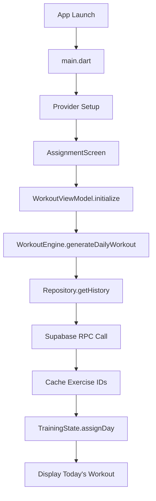

**Detailed Steps**:

1. **App Initialization** (`main.dart`)
   ```dart
   runApp(
     MultiProvider(
       providers: [
         ChangeNotifierProvider(create: (_) => AppState()),
         Provider(create: (_) => SupabaseWorkoutRepository()),
         // ... other providers
       ],
       child: HeavyweightApp(),
     ),
   );
   ```

2. **Assignment Screen Load** (`assignment_screen.dart`)
   ```dart
   @override
   void initState() {
     super.initState();
     WidgetsBinding.instance.addPostFrameCallback((_) {
       _loadWorkoutData();  // Triggers the data flow
     });
   }
   ```

3. **ViewModel Initialization** (`workout_viewmodel.dart`)
   ```dart
   Future<void> initialize() async {
     final history = await repository.getHistory();
     final workout = await engine.generateDailyWorkout(history);
     _todaysWorkout = workout;
     notifyListeners();  // Updates UI
   }
   ```

4. **Engine Determines Today's Workout** (`workout_engine.dart`)
   ```dart
   Future<DailyWorkout> generateDailyWorkout(List<SetData> history) async {
     // 1. Determine current day in rotation
     final workoutCount = _getWorkoutCount(history);
     final dayInCycle = workoutCount % 5;
     final currentDayName = ["CHEST", "BACK", "ARMS", "SHOULDERS", "LEGS"][dayInCycle];
     
     // 2. Save sticky day assignment
     await TrainingState.assignDay(currentDayName);
     
     // 3. Get exercises for today
     final exercises = await _selectTodaysExercisesFromDatabase(history);
     
     // 4. Calculate prescribed weights
     // Uses repository.getLastForExercises() - this is the performance hotspot
   }
   ```

5. **Repository Fetches Data** (`supabase_workout_repository.dart`)
   ```dart
   Future<Map<String, SetData>> getLastForExercises(Set<String> exerciseIds) async {
     // OPTIMIZATION: Try slug-based RPC first
     try {
       final response = await _supabase.rpc('hw_last_for_exercises_by_slug', {
         'slugs': exerciseIds.toList()
       });
       // Single query instead of N queries - 5-10x faster
     } catch (_) {
       // Fallback to ID-based RPC, then individual queries
     }
   }
   ```

**Data Flow Result**: Assignment screen shows in <1 second with today's prescribed weights

---

### **2. User Starts Workout**
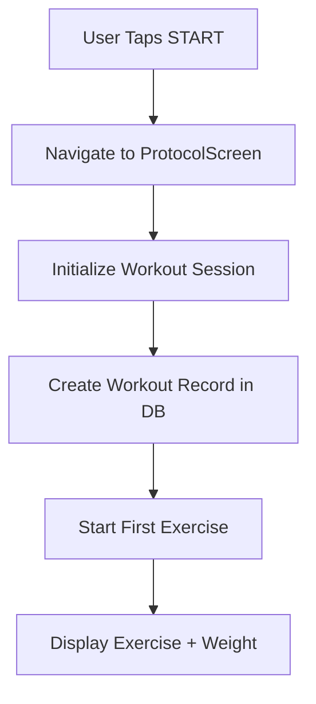

**Implementation**:
```dart
// assignment_screen.dart
onPressed: () {
  context.push('/training/protocol', extra: {
    'workout': todaysWorkout,
    'exercises': selectedExercises,
  });
}

// protocol_screen.dart
@override
void initState() {
  super.initState();
  _createWorkoutSession();  // Creates DB record
  _startFirstExercise();
}
```

---

### **3. Exercise Execution Loop**
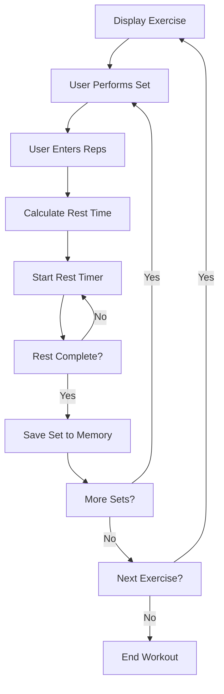

**Set Data Creation**:
```dart
// protocol_screen.dart
void _completeSet(int actualReps) {
  final setData = SetData(
    exerciseId: currentExercise.id,
    weight: currentExercise.prescribedWeight,
    actualReps: actualReps,
    timestamp: DateTime.now(),
    setNumber: currentSetNumber,
    restTaken: _calculateRestTime(actualReps),
  );
  
  _sessionSets.add(setData);  // Store in memory during workout
  
  // Calculate next weight for immediate feedback
  final nextWeight = engine.calculateNextWeight(
    setData.weight, 
    setData.actualReps
  );
}
```

---

### **4. Workout Completion & Data Persistence**
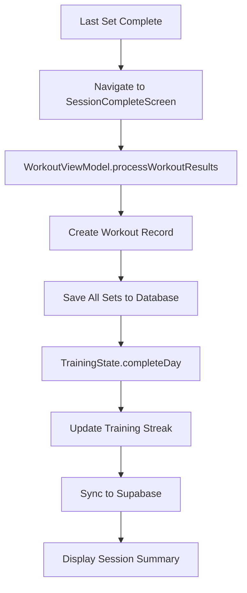

**Batch Data Save**:
```dart
// workout_viewmodel.dart
Future<void> processWorkoutResults(List<SetData> results) async {
  try {
    // 1. Save all sets to database
    for (final set in results) {
      await repository.saveSet(set);
    }
    
    // 2. Update cross-device training state
    await TrainingState.completeDay();
    
    // 3. Refresh cache for next session
    await refresh();
  } catch (e) {
    _setError('Failed to process workout results: $e');
  }
}
```

**Database Operations**:
```dart
// supabase_workout_repository.dart
Future<void> saveSet(SetData set) async {
  // 1. Create workout session if needed
  final workoutId = await _ensureWorkoutExists();
  
  // 2. Get exercise DB ID (cached)
  final exerciseId = await _getExerciseDbId(set.exerciseId);
  
  // 3. Insert set record
  await _supabase.from('sets').insert({
    'workout_id': workoutId,
    'exercise_id': exerciseId,
    'weight': set.weight,
    'actual_reps': set.actualReps,
    'set_number': set.setNumber,
    'rest_taken': set.restTaken,
  });
}
```

---

## 🔄 **Cross-Device Synchronization Flows**

### **Training State Sync**
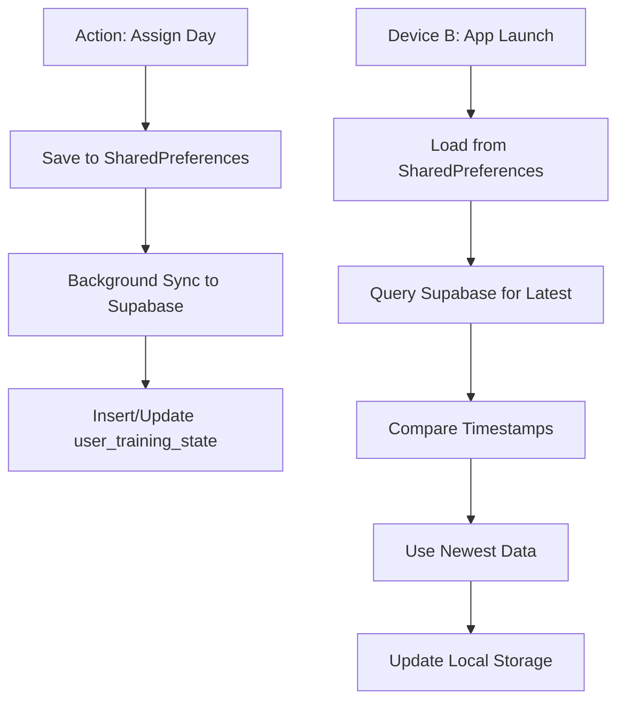

**Implementation**:
```dart
// training_state.dart
static Future<void> assignDay(String dayName) async {
  // 1. Save locally first (always succeeds)
  final prefs = await SharedPreferences.getInstance();
  await prefs.setString(_keyLastAssignedDay, dayName);
  
  // 2. Sync to server (fire-and-forget)
  _syncToServer(dayName);  // Don't await - don't block UI
}

static Future<void> _syncToServer(String dayName) async {
  try {
    await supabase.from('user_training_state').upsert({
      'user_id': supabase.auth.currentUser?.id,
      'last_assigned_day': dayName,
      'last_assigned_at': DateTime.now().toIso8601String(),
    });
  } catch (e) {
    // Silently fail - local state is still saved
    HWLog.event('training_state_sync_failed', data: {'error': e.toString()});
  }
}
```

### **Calibration Resume Sync**
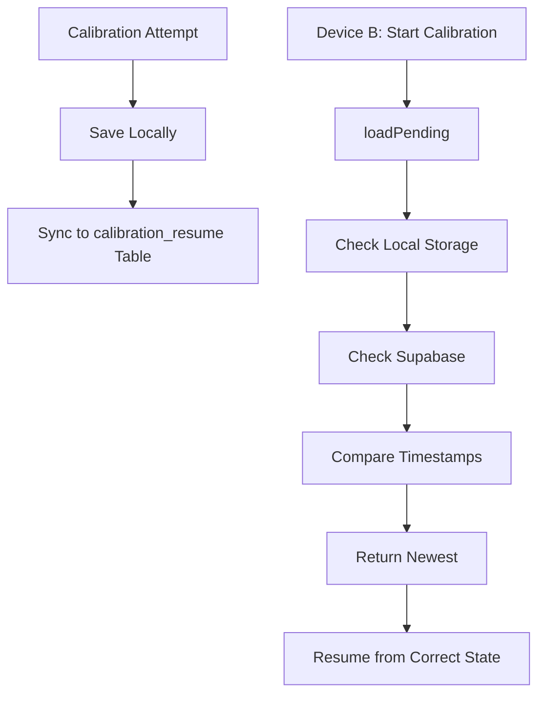

**Implementation**:
```dart
// calibration_resume_store.dart
static Future<CalibrationAttemptRecord?> loadPending() async {
  // 1. Load from both sources
  final localRecord = await _loadFromLocal();
  final serverRecord = await _loadFromServer();
  
  // 2. Use newest-wins strategy
  if (localRecord == null) return serverRecord;
  if (serverRecord == null) return localRecord;
  
  final localTime = DateTime.parse(localRecord.tsIso);
  final serverTime = DateTime.parse(serverRecord.tsIso);
  
  return serverTime.isAfter(localTime) ? serverRecord : localRecord;
}
```

---

## ⚡ **Performance Optimization Flows**

### **Exercise ID Caching**
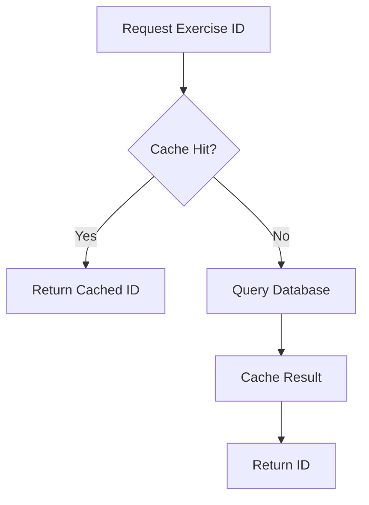

**Implementation**:
```dart
// supabase_workout_repository.dart
class SupabaseWorkoutRepository {
  static final Map<String, int> _exerciseIdCache = {};
  
  Future<int?> _getExerciseDbId(String exerciseSlug) async {
    // Check cache first
    if (_exerciseIdCache.containsKey(exerciseSlug)) {
      return _exerciseIdCache[exerciseSlug];
    }
    
    // Cache miss - query database
    final response = await _supabase
        .from('exercises')
        .select('id')
        .eq('name', mapSlugToName(exerciseSlug))
        .single();
    
    final dbId = response['id'] as int;
    _exerciseIdCache[exerciseSlug] = dbId;  // Cache for next time
    return dbId;
  }
}
```

### **Batch RPC vs Individual Queries**
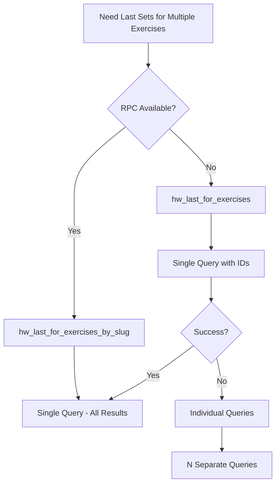

**Performance Impact**:
- **Before**: 5-10 individual queries = 3-5 seconds
- **After**: 1 RPC call = <1 second

---

## 🗂️ **State Management Data Flow**

### **Provider Pattern Flow**
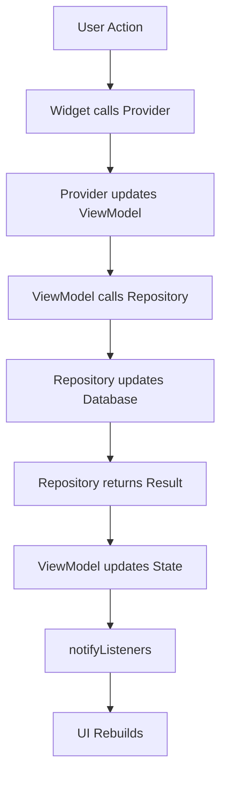

**Example - Starting Workout**:
```dart
// Widget (assignment_screen.dart)
onPressed: () {
  final viewModel = context.read<WorkoutViewModel>();
  viewModel.beginProtocol();  // Triggers state change
}

// ViewModel (workout_viewmodel.dart)
Future<void> beginProtocol() async {
  _isLoading = true;
  notifyListeners();  // UI shows loading
  
  try {
    final result = await repository.createWorkoutSession();
    _currentWorkout = result;
    _isLoading = false;
    notifyListeners();  // UI shows workout
  } catch (e) {
    _error = e.toString();
    _isLoading = false;
    notifyListeners();  // UI shows error
  }
}

// UI rebuilds automatically due to Consumer<WorkoutViewModel>
```

### **Configuration Loading Flow**
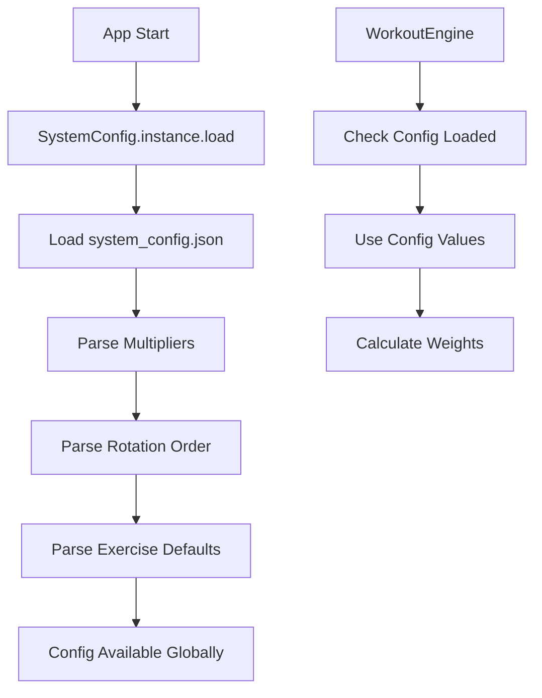

**Implementation**:
```dart
// system_config.dart
class SystemConfig {
  static final SystemConfig instance = SystemConfig._internal();
  
  Future<void> load() async {
    try {
      final configString = await rootBundle.loadString('assets/system_config.json');
      _data = json.decode(configString);
      _isLoaded = true;
    } catch (e) {
      // Use defaults if config fails to load
      _loadDefaults();
    }
  }
  
  double get multiplierFailure => _data['multipliers']['failure'] ?? 0.8;
  double get multiplierBelow => _data['multipliers']['below'] ?? 0.95;
  // ... other config values
}

// workout_engine.dart
double calculateNextWeight(double currentWeight, int actualReps) {
  // Config is loaded once and used throughout
  final cfg = SystemConfig.instance;
  
  if (actualReps == 0) {
    return currentWeight * cfg.multiplierFailure;  // 0.8x
  } else if (actualReps < 4) {
    return currentWeight * cfg.multiplierBelow;   // 0.95x
  }
  // ... rest of logic
}
```

---

## 🔍 **Error Handling Data Flows**

### **Graceful Degradation Pattern**
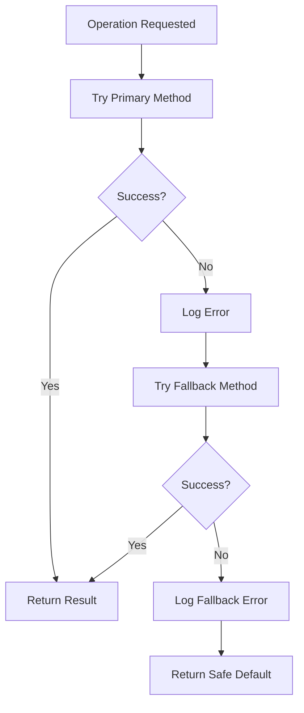

**Repository Example**:
```dart
// supabase_workout_repository.dart
Future<Map<String, SetData>> getLastForExercises(Set<String> exerciseIds) async {
  // Try 1: Slug-based RPC (fastest)
  try {
    return await _getLastWithSlugRPC(exerciseIds);
  } catch (e) {
    HWLog.event('slug_rpc_failed', data: {'error': e.toString()});
  }
  
  // Try 2: ID-based RPC (medium speed)  
  try {
    return await _getLastWithIdRPC(exerciseIds);
  } catch (e) {
    HWLog.event('id_rpc_failed', data: {'error': e.toString()});
  }
  
  // Try 3: Individual queries (slow but reliable)
  try {
    return await _getLastForExercisesFallback(exerciseIds);
  } catch (e) {
    HWLog.event('fallback_failed', data: {'error': e.toString()});
    return <String, SetData>{};  // Empty map - app continues to work
  }
}
```

### **Cross-Device Sync Error Handling**
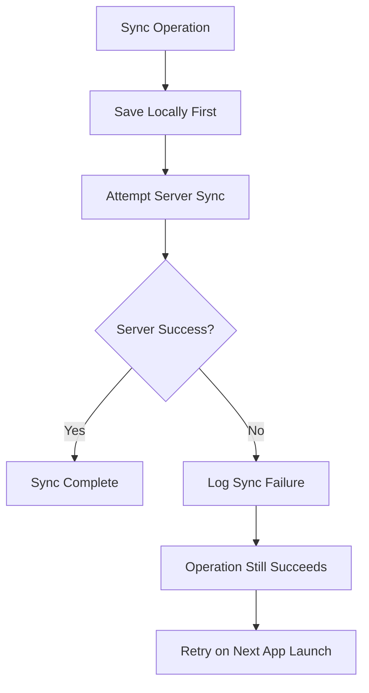

**Local-First Pattern**:
```dart
// training_state.dart
static Future<void> assignDay(String dayName) async {
  // ALWAYS save locally first - this never fails
  final prefs = await SharedPreferences.getInstance();
  await prefs.setString(_keyLastAssignedDay, dayName);
  
  // Try to sync to server, but don't let failure break the operation
  try {
    await _syncToServer(dayName);
    HWLog.event('training_state_synced');
  } catch (e) {
    HWLog.event('training_state_sync_failed', data: {'error': e.toString()});
    // User's action still succeeded - they can continue training
  }
}
```

---

## 🎯 **Critical Data Flow Points**

### **Performance Bottlenecks**
1. **Assignment Screen Load**: Fixed with slug-based RPC
2. **Exercise ID Lookups**: Fixed with caching
3. **Individual Set Queries**: Fixed with batch operations

### **Reliability Critical Points**
1. **Cross-Device Sync**: Must not fail user operations
2. **Local Storage**: Primary source of truth
3. **Database Connections**: Multiple fallback strategies

### **State Consistency Points**
1. **Training Day Assignment**: Immediately saved locally
2. **Workout Completion**: Atomic save operation
3. **Calibration Progress**: Dual persistence strategy

---

*This data flow documentation shows exactly how your app moves information from user actions through all layers to storage and back to the UI. Use this to understand where to make changes and debug issues!*