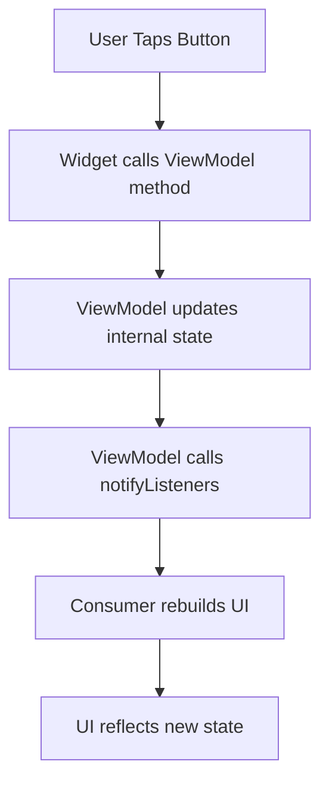
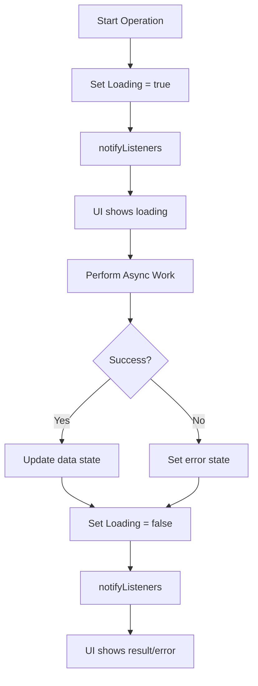

# HEAVYWEIGHT State Management Patterns

## Overview
This document details how state is managed throughout the HEAVYWEIGHT app, covering the Provider pattern implementation, state flow patterns, and best practices for maintaining predictable application state.

---

## 🔄 **State Management Architecture**

### **Pattern: Provider + ChangeNotifier**
```
┌─────────────────┐
│   UI Widgets    │ ← Consumer<T> watches state
├─────────────────┤
│   ViewModels    │ ← ChangeNotifier manages state
├─────────────────┤
│ Business Logic  │ ← Pure functions, no state
├─────────────────┤
│   Repository    │ ← Data access, minimal state
└─────────────────┘
```

**Core Principle**: State flows down, events flow up

---

## 🏗️ **Provider Hierarchy**

### **Main Provider Setup**
```dart
// main.dart
MultiProvider(
  providers: [
    // 1. Core Services (stateless)
    Provider<SupabaseWorkoutRepository>(
      create: (_) => SupabaseWorkoutRepository(),
    ),
    
    // 2. Business Logic (stateless)
    Provider<WorkoutEngine>(
      create: (context) => WorkoutEngine(
        repository: context.read<SupabaseWorkoutRepository>(),
      ),
    ),
    
    // 3. Application State (stateful)
    ChangeNotifierProvider<AppState>(
      create: (_) => AppState(),
    ),
    
    // 4. Feature ViewModels (stateful)
    ChangeNotifierProvider<WorkoutViewModel>(
      create: (context) => WorkoutViewModel(
        repository: context.read<SupabaseWorkoutRepository>(),
        engine: context.read<WorkoutEngine>(),
      ),
    ),
    
    ChangeNotifierProvider<LogbookViewModel>(
      create: (context) => LogbookViewModel(
        repository: context.read<SupabaseWorkoutRepository>(),
      ),
    ),
  ],
  child: HeavyweightApp(),
)
```

### **Dependency Rules**
1. **Services depend on nothing** (bottom layer)
2. **Business logic depends on services** (middle layer)
3. **ViewModels depend on business logic + services** (top layer)
4. **Widgets depend on ViewModels** (UI layer)

---

## 🧠 **ViewModel Pattern Implementation**

### **Base ViewModel Structure**
```dart
// base_viewmodel.dart (conceptual)
abstract class BaseViewModel extends ChangeNotifier {
  bool _isLoading = false;
  String? _error;
  
  bool get isLoading => _isLoading;
  String? get error => _error;
  
  @protected
  void setLoading(bool loading) {
    _isLoading = loading;
    notifyListeners();
  }
  
  @protected
  void setError(String? error) {
    _error = error;
    notifyListeners();
  }
  
  @protected
  void clearError() {
    _error = null;
    notifyListeners();
  }
}
```

### **WorkoutViewModel - Main State Manager**
```dart
// workout_viewmodel.dart
class WorkoutViewModel extends ChangeNotifier {
  final WorkoutRepositoryInterface repository;
  final WorkoutEngine engine;
  
  // Private state
  DailyWorkout? _todaysWorkout;
  bool _isLoading = true;
  String? _error;
  
  // Public getters (read-only state)
  DailyWorkout? get todaysWorkout => _todaysWorkout;
  bool get isLoading => _isLoading;
  String? get error => _error;
  
  // State mutation methods
  Future<void> initialize() async {
    _setLoading(true);
    _clearError();
    
    try {
      final history = await repository.getHistory();
      final workout = await engine.generateDailyWorkout(history);
      
      _todaysWorkout = workout;
      _setLoading(false);
    } catch (e) {
      _setError('Failed to load workout: $e');
      _setLoading(false);
    }
  }
  
  Future<void> beginProtocol() async {
    // Navigation is handled by UI, not ViewModel
    // ViewModel only manages data state
  }
  
  Future<void> processWorkoutResults(List<SetData> results) async {
    _setLoading(true);
    
    try {
      // Save all sets
      for (final set in results) {
        await repository.saveSet(set);
      }
      
      // Update training state
      await TrainingState.completeDay();
      
      // Refresh for next session
      await refresh();
    } catch (e) {
      _setError('Failed to process workout: $e');
    }
    
    _setLoading(false);
  }
  
  Future<void> refresh() async {
    await initialize(); // Reuse initialization logic
  }
  
  // Private helpers
  void _setLoading(bool loading) {
    _isLoading = loading;
    notifyListeners();
  }
  
  void _setError(String? error) {
    _error = error;
    notifyListeners();
  }
  
  void _clearError() {
    _error = null;
    notifyListeners();
  }
}
```

---

## 🎯 **State Flow Patterns**

### **Pattern 1: User Action → State Update**


**Implementation Example**:
```dart
// Screen widget
Consumer<WorkoutViewModel>(
  builder: (context, viewModel, child) {
    return CommandButton(
      text: 'REFRESH',
      onPressed: () {
        viewModel.refresh(); // Triggers state change
      },
    );
  },
)
```

### **Pattern 2: Async Operation → Loading States**


**Implementation Example**:
```dart
Future<void> loadData() async {
  _isLoading = true;
  _error = null;
  notifyListeners(); // UI shows loading immediately
  
  try {
    final data = await repository.fetchData();
    _data = data;
    _isLoading = false;
    notifyListeners(); // UI shows data
  } catch (e) {
    _error = e.toString();
    _isLoading = false;
    notifyListeners(); // UI shows error
  }
}
```

### **Pattern 3: Cross-ViewModel Communication**
```dart
// DON'T: Direct ViewModel-to-ViewModel communication
class BadViewModel extends ChangeNotifier {
  final OtherViewModel otherViewModel; // Coupling!
}

// DO: Communicate through shared dependencies
class GoodViewModel extends ChangeNotifier {
  final Repository repository; // Shared data source
  
  Future<void> updateSharedData() async {
    await repository.updateData(); // Other ViewModels can listen to repo
  }
}

// DO: Use events or shared state
class AppState extends ChangeNotifier {
  String? _globalMessage;
  
  void setGlobalMessage(String message) {
    _globalMessage = message;
    notifyListeners(); // All widgets can react
  }
}
```

---

## 📱 **UI State Consumption Patterns**

### **Consumer Pattern - Reactive UI**
```dart
// Best for: Widgets that need to rebuild when state changes
Consumer<WorkoutViewModel>(
  builder: (context, viewModel, child) {
    if (viewModel.isLoading) {
      return CircularProgressIndicator();
    }
    
    if (viewModel.error != null) {
      return ErrorWidget(viewModel.error!);
    }
    
    return WorkoutDisplay(workout: viewModel.todaysWorkout);
  },
)
```

### **Selector Pattern - Optimized Rebuilds**
```dart
// Best for: Widgets that only care about specific state changes
Selector<WorkoutViewModel, bool>(
  selector: (context, viewModel) => viewModel.isLoading,
  builder: (context, isLoading, child) {
    return isLoading 
      ? CircularProgressIndicator()
      : child!; // Child doesn't rebuild
  },
  child: ExpensiveWidget(), // Only rebuilds when selector value changes
)
```

### **Read Pattern - One-time Access**
```dart
// Best for: Triggering actions without listening to changes
onPressed: () {
  final viewModel = context.read<WorkoutViewModel>();
  viewModel.beginProtocol(); // No rebuild subscription
}
```

### **Watch Pattern - Simple Listening**
```dart
// Best for: Simple value access in build method
@override
Widget build(BuildContext context) {
  final isLoading = context.watch<WorkoutViewModel>().isLoading;
  
  return isLoading 
    ? LoadingWidget()
    : ContentWidget();
}
```

---

## ⚡ **Performance Optimization Patterns**

### **1. Selective Rebuilds with Selector**
```dart
// SLOW: Entire widget rebuilds for any state change
Consumer<LargeViewModel>(
  builder: (context, viewModel, child) {
    return ExpensiveWidget(
      data: viewModel.specificData, // Only care about this field
    );
  },
)

// FAST: Only rebuilds when specific data changes
Selector<LargeViewModel, SpecificData>(
  selector: (context, viewModel) => viewModel.specificData,
  builder: (context, specificData, child) {
    return ExpensiveWidget(data: specificData);
  },
)
```

### **2. Child Widget Optimization**
```dart
// Widget that doesn't change but contains changing parts
Consumer<WorkoutViewModel>(
  builder: (context, viewModel, child) {
    return Column(
      children: [
        child!, // Static part doesn't rebuild
        DynamicContent(data: viewModel.dynamicData),
      ],
    );
  },
  child: ExpensiveStaticWidget(), // Built once, reused
)
```

### **3. State Granularity**
```dart
// BAD: Monolithic state causes unnecessary rebuilds
class BadViewModel extends ChangeNotifier {
  Map<String, dynamic> _allData = {};
  
  void updateAnyField(String key, dynamic value) {
    _allData[key] = value;
    notifyListeners(); // Everything rebuilds!
  }
}

// GOOD: Granular state with specific updates
class GoodViewModel extends ChangeNotifier {
  String? _title;
  List<Item> _items = [];
  bool _isLoading = false;
  
  void updateTitle(String title) {
    _title = title;
    notifyListeners(); // Only title-dependent widgets rebuild
  }
  
  void updateItems(List<Item> items) {
    _items = items;
    notifyListeners(); // Only list-dependent widgets rebuild
  }
}
```

---

## 🔒 **State Consistency Patterns**

### **1. Atomic State Updates**
```dart
// BAD: Multiple notifyListeners() calls
Future<void> badUpdate() async {
  _isLoading = true;
  notifyListeners(); // Rebuild 1
  
  final data = await fetchData();
  _data = data;
  notifyListeners(); // Rebuild 2
  
  _isLoading = false;
  notifyListeners(); // Rebuild 3 - UI flickers!
}

// GOOD: Single notifyListeners() call
Future<void> goodUpdate() async {
  _isLoading = true;
  notifyListeners(); // Initial loading state
  
  try {
    final data = await fetchData();
    _data = data;
    _isLoading = false;
    notifyListeners(); // Final state - smooth transition
  } catch (e) {
    _error = e.toString();
    _isLoading = false;
    notifyListeners(); // Error state
  }
}
```

### **2. Immutable State Updates**
```dart
// BAD: Mutating existing objects
void badUpdateList() {
  _items.add(newItem); // Mutates existing list
  notifyListeners(); // Widgets might not detect change
}

// GOOD: Creating new objects
void goodUpdateList() {
  _items = [..._items, newItem]; // New list reference
  notifyListeners(); // Widgets definitely detect change
}

// GOOD: For complex objects
void updateWorkout() {
  _workout = _workout?.copyWith(
    dayName: newDayName,
    exercises: newExercises,
  );
  notifyListeners();
}
```

### **3. Error State Management**
```dart
class RobustViewModel extends ChangeNotifier {
  String? _data;
  bool _isLoading = false;
  String? _error;
  
  // Clear error when starting new operation
  Future<void> loadData() async {
    _isLoading = true;
    _error = null; // Clear previous error
    notifyListeners();
    
    try {
      _data = await repository.fetchData();
      _isLoading = false;
      // _error stays null on success
      notifyListeners();
    } catch (e) {
      _error = e.toString();
      _isLoading = false;
      // _data remains unchanged on error
      notifyListeners();
    }
  }
  
  // Manual error clearing
  void clearError() {
    _error = null;
    notifyListeners();
  }
}
```

---

## 🏪 **Local State vs Global State**

### **Local State - Widget-Level**
```dart
// Use for: Temporary UI state, form inputs, animations
class ExerciseForm extends StatefulWidget {
  @override
  _ExerciseFormState createState() => _ExerciseFormState();
}

class _ExerciseFormState extends State<ExerciseForm> {
  final _controller = TextEditingController(); // Local only
  bool _isExpanded = false; // Local only
  
  @override
  Widget build(BuildContext context) {
    return Column(
      children: [
        TextField(controller: _controller),
        if (_isExpanded) ...[
          // Additional form fields
        ],
        CommandButton(
          text: 'SUBMIT',
          onPressed: () {
            // Send to global state
            final viewModel = context.read<WorkoutViewModel>();
            viewModel.submitExercise(_controller.text);
          },
        ),
      ],
    );
  }
}
```

### **Global State - App-Level**
```dart
// Use for: Data shared across screens, user state, app configuration
class AppState extends ChangeNotifier {
  bool _isOnboardingComplete = false;
  UserProfile? _userProfile;
  
  bool get isOnboardingComplete => _isOnboardingComplete;
  UserProfile? get userProfile => _userProfile;
  
  void completeOnboarding(UserProfile profile) {
    _isOnboardingComplete = true;
    _userProfile = profile;
    notifyListeners(); // All screens can react
  }
}
```

---

## 🔧 **Advanced State Management Patterns**

### **1. State Machine Pattern**
```dart
enum WorkoutState {
  notStarted,
  inProgress,
  resting,
  completed,
  error,
}

class WorkoutStateMachine extends ChangeNotifier {
  WorkoutState _state = WorkoutState.notStarted;
  
  WorkoutState get state => _state;
  
  void startWorkout() {
    if (_state == WorkoutState.notStarted) {
      _state = WorkoutState.inProgress;
      notifyListeners();
    }
  }
  
  void completeSet() {
    if (_state == WorkoutState.inProgress) {
      _state = WorkoutState.resting;
      notifyListeners();
    }
  }
  
  void finishRest() {
    if (_state == WorkoutState.resting) {
      _state = WorkoutState.inProgress;
      notifyListeners();
    }
  }
}
```

### **2. Command Pattern for State Changes**
```dart
abstract class Command {
  Future<void> execute();
  Future<void> undo();
}

class UpdateWorkoutCommand implements Command {
  final WorkoutViewModel viewModel;
  final DailyWorkout newWorkout;
  late final DailyWorkout _previousWorkout;
  
  UpdateWorkoutCommand(this.viewModel, this.newWorkout);
  
  @override
  Future<void> execute() async {
    _previousWorkout = viewModel.todaysWorkout!;
    await viewModel.updateWorkout(newWorkout);
  }
  
  @override
  Future<void> undo() async {
    await viewModel.updateWorkout(_previousWorkout);
  }
}
```

### **3. Repository Caching Pattern**
```dart
class CachedRepository {
  final Repository _repository;
  final Map<String, CacheEntry> _cache = {};
  
  Future<T> get<T>(String key, Future<T> Function() fetcher) async {
    final cached = _cache[key];
    
    if (cached != null && !cached.isExpired) {
      return cached.data as T;
    }
    
    final data = await fetcher();
    _cache[key] = CacheEntry(data, DateTime.now());
    return data;
  }
}
```

---

## 🐛 **Common State Management Issues**

### **1. Memory Leaks**
```dart
// BAD: Not disposing listeners
class BadViewModel extends ChangeNotifier {
  late Timer _timer;
  
  BadViewModel() {
    _timer = Timer.periodic(Duration(seconds: 1), (_) {
      notifyListeners(); // Keeps ViewModel alive forever!
    });
  }
  // Missing: _timer.cancel() in dispose()
}

// GOOD: Proper disposal
class GoodViewModel extends ChangeNotifier {
  late Timer _timer;
  
  GoodViewModel() {
    _timer = Timer.periodic(Duration(seconds: 1), (_) {
      notifyListeners();
    });
  }
  
  @override
  void dispose() {
    _timer.cancel(); // Cleanup
    super.dispose();
  }
}
```

### **2. Circular Dependencies**
```dart
// BAD: ViewModels depending on each other
class BadViewModelA extends ChangeNotifier {
  final BadViewModelB viewModelB; // Circular!
}

class BadViewModelB extends ChangeNotifier {
  final BadViewModelA viewModelA; // Circular!
}

// GOOD: Shared data source
class GoodViewModelA extends ChangeNotifier {
  final Repository repository; // Shared dependency
}

class GoodViewModelB extends ChangeNotifier {
  final Repository repository; // Shared dependency
}
```

### **3. State Inconsistency**
```dart
// BAD: State scattered across multiple places
class InconsistentState {
  bool loading1 = false; // In ViewModel
  bool loading2 = false; // In Widget
  bool loading3 = false; // In Repository
  // Which one is true?
}

// GOOD: Single source of truth
class ConsistentState extends ChangeNotifier {
  bool _isLoading = false; // Only here
  
  bool get isLoading => _isLoading; // Read-only access
  
  void _setLoading(bool loading) {
    _isLoading = loading;
    notifyListeners();
  }
}
```

---

## 🧪 **Testing State Management**

### **ViewModel Testing**
```dart
// test/viewmodels/workout_viewmodel_test.dart
void main() {
  group('WorkoutViewModel', () {
    late MockRepository mockRepository;
    late MockEngine mockEngine;
    late WorkoutViewModel viewModel;
    
    setUp(() {
      mockRepository = MockRepository();
      mockEngine = MockEngine();
      viewModel = WorkoutViewModel(
        repository: mockRepository,
        engine: mockEngine,
      );
    });
    
    test('should load workout on initialize', () async {
      // Arrange
      final workout = DailyWorkout(dayName: 'CHEST');
      when(mockRepository.getHistory()).thenAnswer((_) async => []);
      when(mockEngine.generateDailyWorkout(any)).thenAnswer((_) async => workout);
      
      // Act
      await viewModel.initialize();
      
      // Assert
      expect(viewModel.todaysWorkout, equals(workout));
      expect(viewModel.isLoading, false);
      expect(viewModel.error, null);
    });
    
    test('should handle errors gracefully', () async {
      // Arrange
      when(mockRepository.getHistory()).thenThrow(Exception('Network error'));
      
      // Act
      await viewModel.initialize();
      
      // Assert
      expect(viewModel.todaysWorkout, null);
      expect(viewModel.isLoading, false);
      expect(viewModel.error, contains('Network error'));
    });
  });
}
```

### **Widget State Testing**
```dart
// test/widgets/assignment_screen_test.dart
void main() {
  testWidgets('should show loading indicator', (tester) async {
    // Arrange
    final mockViewModel = MockWorkoutViewModel();
    when(mockViewModel.isLoading).thenReturn(true);
    
    // Act
    await tester.pumpWidget(
      ChangeNotifierProvider<WorkoutViewModel>.value(
        value: mockViewModel,
        child: MaterialApp(home: AssignmentScreen()),
      ),
    );
    
    // Assert
    expect(find.byType(CircularProgressIndicator), findsOneWidget);
  });
}
```

---

## 📋 **State Management Checklist**

### **Architecture**
- [ ] Clear separation: UI → ViewModel → Business Logic → Repository
- [ ] Single responsibility: Each ViewModel manages one feature area
- [ ] Unidirectional data flow: State down, events up

### **Performance**
- [ ] Use Selector for expensive widgets
- [ ] Minimize notifyListeners() calls
- [ ] Cache expensive computations
- [ ] Dispose resources in ViewModel.dispose()

### **Consistency**
- [ ] Single source of truth for each piece of state
- [ ] Immutable state updates
- [ ] Proper error handling
- [ ] Clear loading states

### **Testing**
- [ ] Unit tests for ViewModels
- [ ] Widget tests for state consumption
- [ ] Integration tests for state flows
- [ ] Mock all external dependencies

---

*This state management guide ensures predictable, performant, and maintainable state throughout the HEAVYWEIGHT app!*